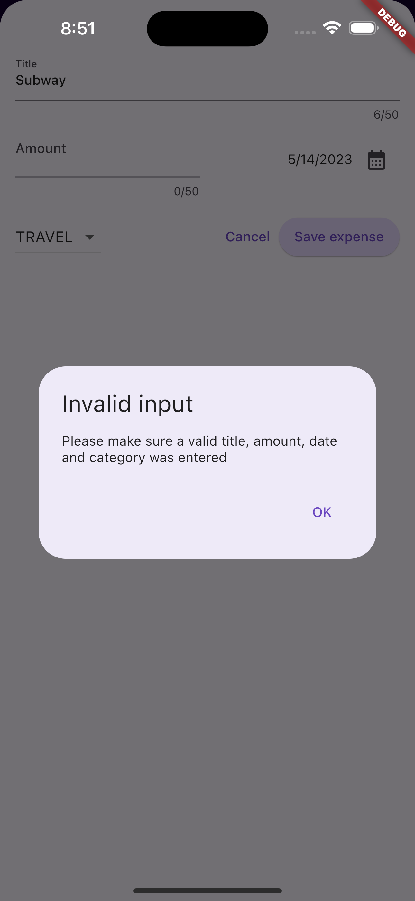

# Flutter Expense Tracker

This is a flutter project to track expenses. Following features are available in the app:

- Shows list of expenses
- Shows graphical view of expense categories
- Allows to add new expense
    - Title of expense
    - Expense amount in number
    - Expense date (needs to be selected from datepicker)
    - Expense category (to be selected from list of categories)
- Has validation if invalid input is entered
- Allows to delete expense by swiping any record
- Allows to undo any delete
- Support for theme change and dark mode
- Support for landscape view

# Screenshots

### Expense list and graph

 

### Add expense

 

### Datepicker

 

### Validation for invalid input

 

### Validation for invalid input in iOS device

 

### Delete an expense

 

### Undo delete

### Landscape view landing

### Landscape view for add expense

